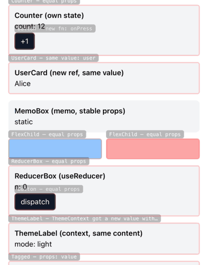

<p align="center">
  
</p>

<h1 align="center">WhyRN</h1>

<p align="center">
  See exactly <strong>why</strong> your React Native components re-render.
</p>

<p align="center">
  <a href="https://www.npmjs.com/package/whyrn.dev"></a>
  <a href="https://www.npmjs.com/package/whyrn.dev"></a>
  <a href="https://github.com/vladbars/whyrn/blob/main/LICENSE"></a>
</p>

---

<p align="center">
  
</p>

> Components flash on re-render. A badge tells you *why*. No more guessing.

---

## Why?

Ever stared at your React Native app and asked:

- *"Why is this re-rendering?"*
- *"Why is my FlatList so laggy?"*
- *"Which prop is causing this?"*

React Native doesn't tell you. The Profiler gives you timing, not reasons. Console logs don't show you *where*.

**WhyRN does.**

It highlights re-renders **on screen**, shows the **exact reason** — which prop changed, which state updated, whether it's a new reference or a real value change — and paints a **heatmap** so you can spot the hottest components instantly.

---

## Features

- 🔁 **Highlights re-renders in real time** — components flash with a colored border
- 🧠 **Shows exact reason** — props, state, hooks, or parent re-render
- 🔍 **Props diff** — distinguishes reference change vs value change
- 🌡️ **Heatmap mode** — cold (blue) to hot (red) based on render frequency
- ⚡ **Zero config** — wrap your app, done
- 📱 **React Native first** — built for mobile, not a web port
- 🪶 **Zero dependencies** — only React and React Native as peers
- 🔇 **Dev only** — no-op in production, tree-shaken away

---

## Install

```bash
npm install whyrn.dev
```

```bash
yarn add whyrn.dev
```

---

## Usage

```tsx
import { WhyRN } from 'whyrn.dev';

export default function App() {
  return (
    <WhyRN>
      <YourApp />
    </WhyRN>
  );
}
```

That's it. **No init function, no config files, no babel plugins.**

Every component that re-renders will flash on screen with a badge showing the reason.

---

## Example Output

When a component re-renders, you see this in the console:

```
🔁 UserCard re-rendered (#4)
  prop "user" changed (new reference, same value)
  state[0] changed: 1 → 2
```

And on screen:

```
┌──────────────────────────────┐
│ UserCard — props: user       │  ← badge
├──────────────────────────────┤
│                              │
│     ┌─── red border ───┐    │  ← flash overlay
│     │                   │    │
│     │    UserCard       │    │
│     │                   │    │
│     └───────────────────┘    │
│                              │
└──────────────────────────────┘
```

---

## Track Specific Components

Don't want to track everything? Use the HOC:

```tsx
import { withWhyRN } from 'whyrn.dev';

function UserCard({ user }) {
  return <Text>{user.name}</Text>;
}

export default withWhyRN(UserCard);
```

Or the hook, for full control:

```tsx
import { useWhyRN } from 'whyrn.dev';

function UserCard(props) {
  const reasons = useWhyRN('UserCard', props);
  // reasons = [{ type: 'props', propChanges: [...] }]
  return <Text>{props.user.name}</Text>;
}
```

---

## Heatmap Mode

See which components render the most — cold (blue) means few renders, hot (red) means many:

```tsx
<WhyRN heatmap>
  <YourApp />
</WhyRN>
```

The border color shifts based on render frequency in a 5-second sliding window.

---

## Configuration

All options are passed as props. Every prop is optional.

```tsx
<WhyRN
  enabled={__DEV__}              // Kill switch (default: __DEV__)
  trackHooks                     // Track useState/useReducer (default: true)
  logToConsole                   // Log to console (default: true)
  heatmap                        // Heatmap mode (default: false)
  flashDuration={600}            // Flash duration in ms (default: 600)
  flashColor="#FF6B6B"           // Flash border color (default: #FF6B6B)
  heatmapColdColor="#3B82F6"     // Heatmap cold color (default: #3B82F6)
  heatmapHotColor="#EF4444"      // Heatmap hot color (default: #EF4444)
  include={[/Screen/, /Card/]}   // Only track matching names (default: [])
  exclude={[/^RN/, /^RCT/]}     // Skip matching names (default: RN internals)
>
  <YourApp />
</WhyRN>
```

---

## API Reference

### `<WhyRN>`

Root provider. Wraps your app to enable visual overlays and auto-tracking.

### `withWhyRN(Component, name?)`

HOC that tracks a specific component. Works with or without `<WhyRN>` — without the wrapper, it logs to console only.

### `useWhyRN(name, props)`

Hook that returns an array of `RenderReason` objects for the current render. Useful for custom debugging UI or logging.

### `useRenderCount(name?)`

Simple hook that returns how many times the component has rendered. Optionally logs to console.

---

## Comparison

| Feature | why-did-you-render | React DevTools | **WhyRN** |
|---|---|---|---|
| React Native support | ⚠️ Partial | ✅ | ✅ |
| Visual overlay | ❌ | ⚠️ Border only | ✅ Flash + badge |
| Shows *why* | ⚠️ Console only | ❌ | ✅ On screen |
| Props diff | ✅ | ❌ | ✅ |
| Reference vs value | ⚠️ | ❌ | ✅ |
| Heatmap | ❌ | ❌ | ✅ |
| Zero config | ❌ Needs init + babel | ❌ | ✅ |
| Hook tracking | ✅ | ❌ | ✅ |

---

## How It Works

1. `<WhyRN>` patches `React.createElement` on mount to wrap tracked components with a thin HOC
2. The HOC stores previous props in a `useRef` and diffs on every render
3. When a re-render is detected, it calls `measureInWindow` to get the component's screen position
4. A global overlay renders an `Animated.View` border that fades out, plus a reason badge
5. In heatmap mode, the border color is computed from the render rate in a sliding window

Since we only care about **re-renders** (not the first render), patching at mount time is fine. The library is a complete no-op when `__DEV__` is false.

---

## Requirements

- React 18+
- React Native 0.70+
- Hermes or JSC

---

## Roadmap

- [ ] Expo Snack playground
- [ ] State variable name extraction (babel plugin)
- [ ] Flipper / DevTools integration
- [ ] Per-component render timeline
- [ ] Re-render count badge overlay
- [ ] Context tracking with provider name

---

## Contributing

Contributions are welcome! Please open an issue first to discuss what you'd like to change.

---

## License

MIT

---

<p align="center">
  If WhyRN helps you debug faster, consider giving it a ⭐
  <br />
  <a href="https://github.com/vladbars/whyrn">github.com/vladbars/whyrn</a>
</p>
